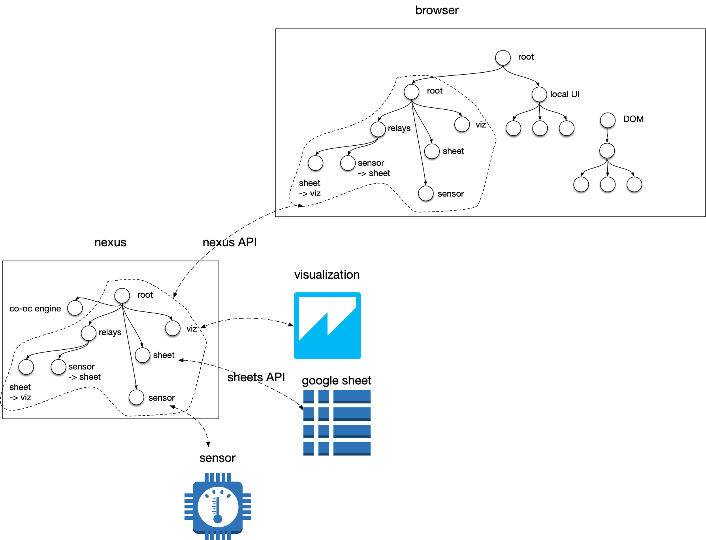

# nexus-gsheets
A Nexus adapter for Google Sheets.

Spreadsheets broadly, and Google Sheets in particular, are a lingua franca for both formal and informal data collection and analysis.
However... what's our however? 

## How to use nexus-gsheets as a development library
(If you want to develop Infusion/Nexus applications that interact with Google spreadsheets.)

### Installing the library
```npm install```
...then what?
Since this should be distributed simply as some grades, I should indicate how those grades might be put to use by reference to a demo project where those grades are actually deployed on a nexus.

### Deploying spreadsheet integrations


This is an imagined deployment of the Nexus with this adaptation.
It implies that we are missing functionality in the Nexus API for mirroring (part of) the Nexus component tree in a browser Infusion instance.
It also opens some questions about the practice of programming applications that intermix Infusion components and local-to-the-browser UI components.

### Addressing Google spreadsheets
Google spreadsheets are adressed by a combination of a spreadsheetId, sheetName, and a range or coordinate in A1 notation.
The spreadsheetId is the alphanumeric identifier found in the URL for a spreadsheet, e.g. in `https://docs.google.com/spreadsheets/d/1B2769NqCW1yBlP_eT6kQ5iRBM1cbYyhB_0paDgNT6dk/` the spreadsheetId is `1B2769NqCW1yBlP_eT6kQ5iRBM1cbYyhB_0paDgNT6dk`.
The sheetName is the identifier of a single 'tab' within the spreadsheet. It can be set by the user. The default value for the single tab in a new spreadsheet is `Sheet1`.
A coordinate is written as a combination of letters referring to the column and a number referring to the row, e.g. `A1` for the top left cell.
A range is written as two coordinates with a colon between them, e.g. `A1:B2` is the square of four cells at the top left of a spreadsheet.
The first coordinate in a range must be in a lower column or row than the second coordinate.
In API functions, the sheetName and coordinate/range are combined in one string, written `{sheetName}!{coordinate/range}`, e.g. `Sheet1!A1:B2`

## Things you can make with nexus-gsheets

### make a live visualization of a spreadsheet

### collect streamed data in a spreadsheet

### set up fine-grained data sharing between two spreadsheets

## development plan
 - [x] read data from a spreadsheet
 - [x] make a config file defining aliases for sheets of interest, token location, credentials location
 - [x] write data to a spreadsheet
 - [x] create a sheet in a Nexus component tree
 - [x] create a super-basic browser-and-Nexus setup
 - [x] figure out how to package Nexus adapters as grades available to a Nexus instance on startup. Maybe copy Kettle's config functionality?
 - [x] set up unit testing, including a test mock of the google sheets API client object. 
 - [ ] support interactive token creation
 - [ ] figure out how to distribute the demo. I assume it either needs to work with public sheets, or there should be a user dialog for setting up credentials and either providing a URL or naming the data to go in a sheet
 - [ ] poll sheets for updates

Do I depend on the nexus or not?
If I want to start the Nexus server from here, yes.
That means starting a kettle server that hosts a component tree which may be manipulated through the Nexus API.
the existing demos don't actually depend on the nexus? They just assume one will be started elsewhere
what is my ideal setup process?
open the demo, possibly open a google spreadsheet

The goal is to integrate spreadsheets with each other and with other functionality.
Sometimes we mediate this integration in interesting ways.
  - connecting spreadsheets to external data sources to ease the labor of manual data entry
  - connecting spreadsheets to each other to help people share data
  - connecting local spreadsheets to shared spreadsheets to support people using their own preferred interface
  - connecting spreadsheets to visualizations (in some improved ways???)

## what should be tested
 - [x] conversion from numerical coordinates to A1 notation
 - [x] component models contain the expected results after creation
 - [x] API calls to all endpoints are correctly formatted
 - [ ] repeated reads work after changes in the 'remote' data?
 - [ ] model edits causes API writes
 - [ ] component creation does not cause API writes
 - [ ] writes transmit between two sheet objects with the same remote sheet
 - [ ] data written to a remote sheet then read again is identical 

### automatically reading sheets on change
It looks like I will have the implement the sheets -> nexus path with manual polling.
This requires some pretty robust machinery that reports remote changes, issues re-reads from relevant components, and doesn't issue fresh ones if any are still in progress.
This last part is a promise throttler.
There's a fair amount of work on how to implement such a mechanism well, e.g. https://github.com/cujojs/when/blob/master/docs/api.md#whenguard
We won't necessarily use a powerful implementation like that, but it may be inspiring.
We also need a diff function to check that a pinging spreadsheet has actually changed relative to the local I have.
There's a fluid.model.diff function (see: https://github.com/amb26/infusion/blob/FLUID-6145/src/framework/core/js/DataBinding.js#L1584 )
For reporting, we may want to use the google drive push notification API, where we can provide a public HTTP endpoint that gets notified on updates (see: https://developers.google.com/drive/api/v3/reference/changes/watch ).
